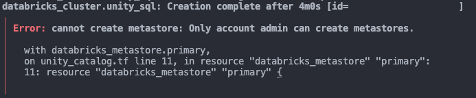

# Azure Databricks Delta Lakehouse 
## Infrastructure Deployment

## Known Limitations - Caveats - Issues
### Only account admin can create metastores.
When deploying a Databricks Metastore for the first time, an error messages will appear.

Sadly, this issue as of writing, can be remediated with an automated deployment. A user with **Azure Active Directory Global Administrator** permissions, has to sign into the Azure Databricks account cosnsole for the first time. Only then, are you able deploy metastore unity Databricks metastore.

This requirement is described in this documentation https://learn.microsoft.com/en-us/azure/databricks/data-governance/unity-catalog/get-started#requirements